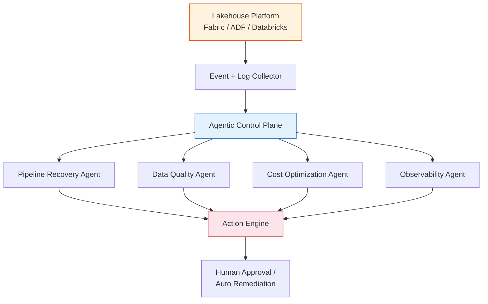

--------------------------------------------------------

👉 “Autonomous Lakehouse Operations Platform”

Combine:

Self-healing pipelines
Data quality agent
Cost optimization agent
Observability

Deploy on:
Databricks OR Fabric
Kubernetes (optional but powerful)

--------------------------------------------------------
Autonomous Lakehouse Operations Platform

A production-grade AI control plane for lakehouse platforms that can:

Detect pipeline failures
Diagnose root cause
Validate data quality
Recommend or execute recovery actions
Monitor cost/performance
Expose everything through observability dashboards
Best scope for you

Start with Microsoft Fabric + ADF, then extend to Databricks.

That gives you:

strong Azure alignment
enterprise data engineering relevance
agentic AI angle
MLOps/platform engineering credibility
Core system

What the platform should include
1. Self-Healing Pipeline Agent

Handles:

failed pipeline runs
retry logic
root-cause classification
timeout detection
schema mismatch detection
source/sink availability checks

Example action:

Pipeline failed because source schema changed.
Recommended action: block downstream table, request schema approval, retry after mapping update.
2. Data Quality Agent

Handles:

missing values
schema drift
volume anomalies
freshness checks
duplicate records
data contract violations

Use:

Great Expectations
Soda Core
Deequ
custom SQL checks
3. Cost Optimization Agent

Handles:

expensive runs
long-running jobs
oversized compute
repeated retries
inefficient Spark/Fabric jobs

Example actions:

This pipeline cost increased 43% over baseline.
Recommended: reduce parallelism, review partitioning, cache dimension table.
4. Observability Layer

Track:

pipeline success/failure rate
diagnosis accuracy
remediation success rate
cost per pipeline
data quality failures
time to recovery

Use:

Prometheus
Grafana
OpenTelemetry
structured JSON logs
Recommended architecture
autonomous-lakehouse-ops/
│
├── apps/
│   ├── api/
│   ├── worker/
│   └── dashboard/
│
├── packages/
│   ├── agents/
│   │   ├── coordinator/
│   │   ├── pipeline_recovery/
│   │   ├── data_quality/
│   │   ├── cost_optimizer/
│   │   └── observability/
│   │
│   ├── platform_adapters/
│   │   ├── fabric/
│   │   ├── adf/
│   │   └── databricks/
│   │
│   ├── action_engine/
│   ├── memory/
│   ├── policies/
│   └── telemetry/
│
├── infra/
│   ├── docker/
│   ├── kubernetes/
│   ├── helm/
│   └── grafana/
│
├── examples/
│   ├── pipeline_failure/
│   ├── schema_drift/
│   ├── cost_spike/
│   └── dq_failure/
│
└── README.md
Build order

Do it in this sequence:

Foundation
FastAPI
Postgres
event ingestion
worker
audit logging
Pipeline Recovery Agent
failure classification
ADF/Fabric adapter
retry/propose-action flow
Data Quality Agent
schema drift
freshness
null checks
volume anomaly checks
Cost Optimization Agent
run duration baseline
compute/cost anomaly rules
optimization recommendations
Observability
Prometheus metrics
Grafana dashboards
OpenTelemetry traces
Kubernetes
Helm chart
secrets
config maps
ingress/gateway
service accounts
My honest recommendation

Build this as:

Autonomous Lakehouse Operations Platform for Microsoft Fabric, ADF, and Databricks

But implement in this order:

ADF first → Fabric second → Databricks third

Why?

ADF gives you mature APIs.
Fabric gives you Microsoft’s modern lakehouse story.
Databricks gives you the strongest technical depth.

This becomes much stronger than a single “agentic orchestrator.” It becomes a real AI operations platform for data engineering.